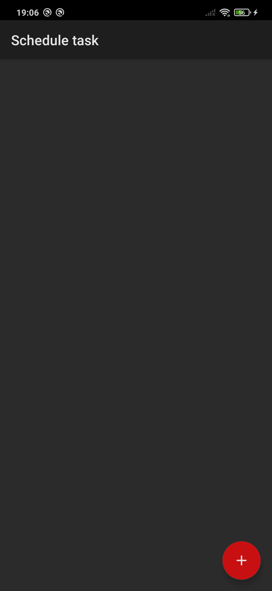
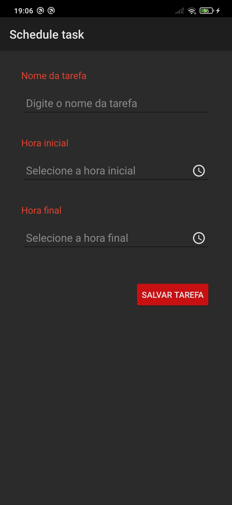
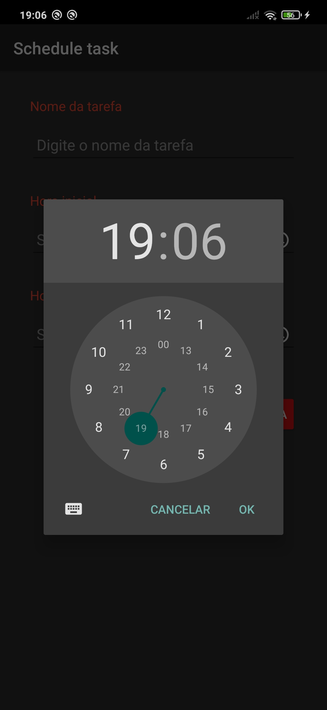
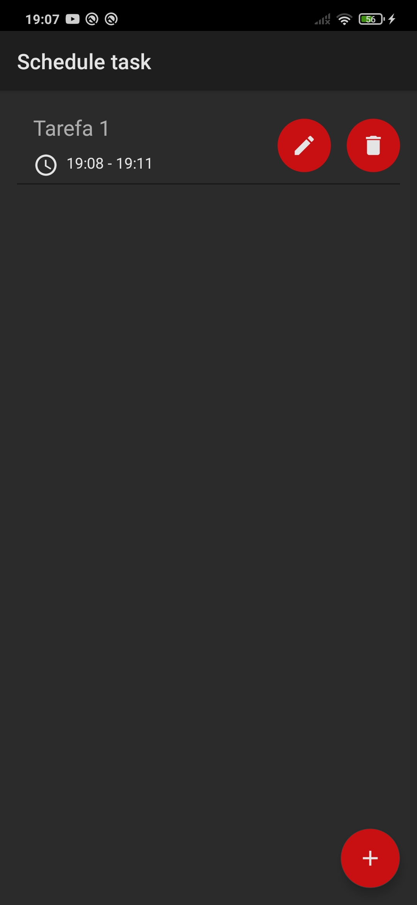
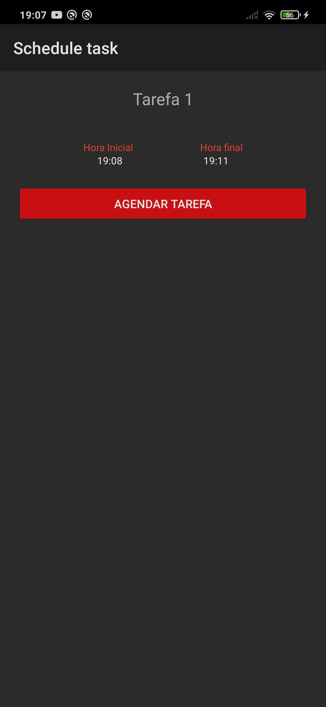
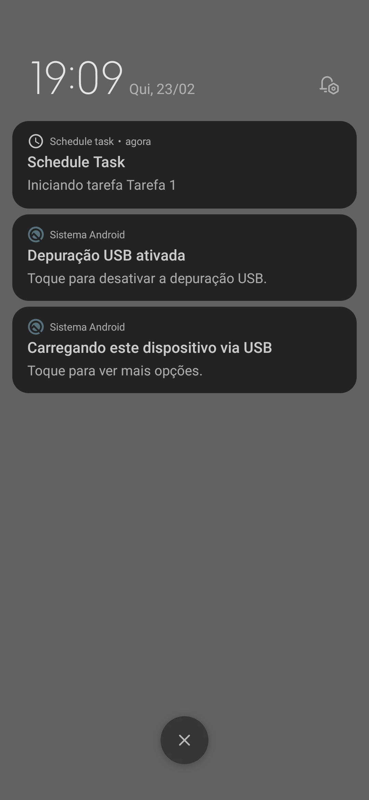

    <h1 align="center">Scheduled Task App</h1>

## 🌟 Sobre

Um aplicativo simples de gerenciamento de lista de tarefas que ajuda você a fazer as coisas. Construído com o Kotlin, ajuda o usuário a adicionar sua tarefa e assim que ela inicia uma notificação é emitida.

Entre o início e o fim da tarefa registrada, a aplicação coleta dados do GPS do dispositivo a cada 5 segundos e grava em um arquivo CSV no dispositivo, com os seguintes atributos (tempo, latitude, longitude, altitude, tarefa).

As tarefas concluídas ou qualquer tarefa podem ser excluidas como desejar. Elas são salvas no banco de dados local usando o ROOM.

## ✨ Screenshots

 

## 🚀 Introdução

Essas instruções fornecerão uma cópia do projeto em funcionamento em sua máquina local para fins de desenvolvimento e teste.

### Pré -requisitos

- Android Studio
- Java JDK

## 📃 bibliotecas usadas

- [Kotlin](https://kotlinlang.org/) - Primeira classe e linguagem de programação oficial para desenvolvimento do Android.
- [Coroutines](https://kotlinlang.org/docs/reference/coroutines-overview.html) - para assíncrono e muito mais ..
- [Room](https://developer.android.com/topic/libraries/architecture/room) - Biblioteca de mapeamento de objetos sqlite.
- [RECYCLERVIEW](https://developer.android.com/Jetpack/androidx/releases/recycLerview) - Exiba grandes conjuntos de dados na sua interface do usuário enquanto minimizam o uso da memória.
- [ViewBinding](https://developer.android.com/topic/libraries/view-binding) - gera uma classe de ligação para cada arquivo de layout XML presente nesse módulo e permite que você escreva mais facilmente o código que interage com as visualizações.
- [Broadcast Receiver](https://developer.android.com/guide/components/broadcasts?hl=pt-br) - Nos permitem registrar eventos do sistema e do aplicativo, e os receptores de registro são alertados quando o evento ocorre.
- [SharedPreferences](https://developer.android.com/training/data-storage/shared-preferences?hl=pt-br) - Nos permitem armazenar e acessar valores simples.
- [Notificações](https://developer.android.com/training/notify-user/build-notification?hl=pt-br) - As notificações fornecem informações curtas e oportunas sobre eventos no seu app enquanto ele não está em uso.
- [OpenCSV](https://opencsv.sourceforge.net/) - É uma biblioteca de CSV (comma-separated values) para uso fácil.
- [Easy Permissions](https://github.com/googlesamples/easypermissions) - Biblioteca wrapper para simplificar a lógica básica de permissões do sistema ao direcionar o Android M ou superior.

## 🔨 Construa e execute o aplicativo

Siga essas etapas para obter o projeto de trabalho!
`` `

1. Clone este repositório ou faça o download do arquivo
2. Extrair ZIP se baixado o código
3. Projeto aberto no Android Studio
4. Aguarde enquanto o Android Studio Download gradle ou os arquivos necessários
5. Pressione o botão Executar!
   `` `
